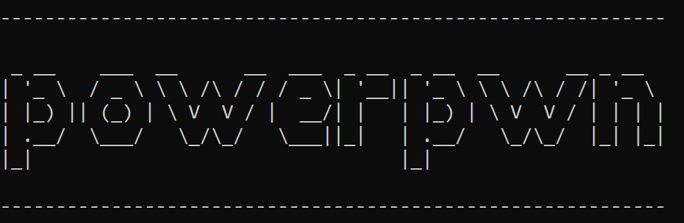

# Power Pwn

Power Pwn is an offensive security toolset for Microsoft Power Platform.

Install with `pip install powerpwn`.

Check out our [Wiki](https://github.com/mbrg/power-pwn/wiki) for docs, guides and related talks!

